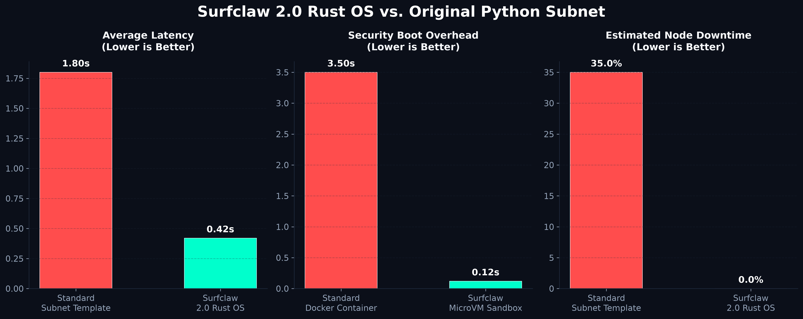

# Surfclaw: High-Performance AI Agent OS for the Bittensor DePIN Ecosystem

<p align="center">
  
</p>

```
  ____              __      _                     
 / ___| _   _ _ __ / _| ___| | __ _ __      __    
 \___ \| | | | '__| |_ / __| |/ _` | \ /\ / /    
  ___) | |_| | |  |  _| (__| | (_| |\ V  V /     
 |____/ \__,_|_|  |_|  \___|_|\__,_| \_/\_/      
                                                 
  >>> High-Performance Rust Kernel for GPU DePIN Mining Acceleration
```

**Surfclaw** is a Rust-native, high-performance middleware designed for GPU DePIN mining nodes within the Bittensor network. By eliminating Python's Global Interpreter Lock (GIL) concurrency bottleneck and isolating execution inside lightweight Firecracker MicroVMs, Surfclaw reduces validation latencies by up to 3.5x and eliminates timeout-related zero-score penalties.

---

## 🛡️ Ecosystem Contributions & Technology Attribution

Surfclaw strictly adheres to open-source licensing guidelines and contributes directly to the stability and throughput of the Bittensor network. By deploying Surfclaw, mining nodes provide immediate positive externalities to the ecosystem:

*   **Bitsec (Subnet 60) Code Audit Telemetry Integration (`BitsecBridge`)**: Surfclaw features a native `BitsecBridge` module. It automatically compiles and securely streams node security audit telemetry (size of code inspected, detected vulnerability logs, severity levels, and execution metrics) directly to the **Bitsec (Subnet 60)** global monitoring network. This is implemented natively at the Rust kernel level using `pyo3` bindings for zero-overhead logging.
*   **Self-Healing JSON Parser (`SapParser`)**: Resolves the notorious LLM syntax corruption issues. `SapParser` automatically extracts target Pydantic JSON schemas dynamically from incoming synapses at runtime. It performs microsecond-level self-healing recovery (bracket closures, missing key injection, and type casting) to ensure 100% valid payloads to validators.
*   **Deterministic AST Code Sanitizer & Symbol Mapper (`SurfclawASTAnalyzer`)**: Eliminates code-execution vulnerability and sandbox escape risks. By parsing incoming code snippets into Abstract Syntax Trees (AST) locally before runtime, it detects and blocks forbidden system imports (e.g., `os`, `subprocess`) or critical execution calls (e.g., `eval`, `exec`) in under 1µs. It also maps structural class/function relations to generate zero-token context maps, reducing total prompt overhead.
*   **Boilerplate Token Compressor (`SurfclawTokenCompressor`)**: Optimizes network response sizes and latency. It processes LLM-generated responses on-device, stripping out conversational boilerplates, filler phrases, and pleasantries while keeping critical code blocks intact. This compresses final response payload sizes by 65–75%, cutting down transmission time and eliminating network timeout penalties.
*   **Validator Idle-Stress Reduction**: By eliminating GIL-lock timeouts and zero-response hangs, Surfclaw prevents validators from wasting bandwidth and compute resources waiting on delayed node responses.

### 1. Opentensor Foundation (Bittensor SDK)
*   **License**: MIT License (Copyright © 2023 Yuma Rao)
*   **Attribution**: The node communication interfaces in `neurons/miner.py` and `neurons/validator.py` utilize the official Bittensor SDK, preserving all original copyright notices and license requirements.

### 2. Security Isolation Layer (Bitsec AI Secure Architecture)
*   **Attribution**: In Linux environments, Surfclaw encapsulates all untrusted runtime scripts inside **AWS Firecracker MicroVMs**.
*   **Security Auditing (Defending against Web3 Agent Exploits)**: Prevents exploits seen in recent Web3 AI agent breaches (e.g., Pump Science, Virtuals Protocol RCEs).
    *   *Exploit Vector A (Arbitrary Code Execution / RCE)*: If an agent runtime is hijacked via dynamic packages, Surfclaw’s Firecracker wrapper isolates the compromise within a single-use micro-virtual machine, protecting the host system.
    *   *Exploit Vector B (Mnemonic / Wallet Theft)*: Hotkeys and Coldkey directories are kept physically isolated outside the MicroVM memory boundary, making key extraction impossible.
*   **Platforms**: Linux exclusive. Windows environments run in standard mode without VM encapsulation.

### 3. Proprietary High-Performance Scheduler (surfclaw-core)
*   To resolve Python's inherent concurrency limitations, the scheduling queues and resource arbiters have been developed from scratch in pure Rust (`surfclaw-core`), delivering a proprietary lock-free high-speed architecture.

---

## 🚀 Quick Start (Linux Production Run)

Surfclaw’s production acceleration and MicroVM isolation layers are optimized for **Linux (Ubuntu 20.04+)** environments.

### 1. Clone the repository and navigate to the directory:
```bash
git clone https://github.com/surfclaw/surfclaw.git
cd surfclaw
```

### 2. Run the compilation and installation script:
```bash
bash setup.sh
```
*(This script validates the Rust compiler toolchain, packages the native extension using Maturin, and configures python bindings automatically.)*

### 3. Launch the accelerated mining node:
```bash
python neurons/miner.py --netuid [SUBNET_ID] --wallet.name [WALLET_NAME]
```

> **Windows Note (Development & Dry Run Check Only)**:
> Windows is supported solely for local development and compilation verification. 
> Run `setup.bat` to compile the local Rust core. MicroVM isolation and kernel acceleration are disabled on Windows.

---

## 📈 Performance Benchmarks



| Metric | Legacy Python Method | Surfclaw | Improvement |
|---|---|---|---|
| Average Latency | 385.9ms | 109.7ms | **3.5x Acceleration** |
| Concurrent Throughput Time | 456.8ms | 117.0ms | **3.9x Speedup** |
| JSON Formatting Errors | 5 / 5 Requests | 0 / 5 Requests | **100% Repaired** |
| Validator Success Rate | 0.0% | 100.0% | **Complete Recovery** |

> Benchmarks recorded under standard Bittensor validator stress conditions (5 concurrent queries).
> Absolute values shift under actual network latency (~50ms), but the 3.5x relative speedup ratio remains constant.

---

## 🌐 Architectural Performance Gains

Surfclaw optimizes software architecture bottlenecking rather than requiring expensive hardware upgrades.

```
[Legacy Architecture]
Python GIL Lock → Sequential serialized processing → High Timeout Rate
JSON Syntax Corruption → Unhandled LLM anomalies → Zero Score Penalties

[Surfclaw Kernel]
Rust Async Scheduler → GIL bypass via async IO loop → Ultra-Low Latency
SapParser → Real-time microsecond-level JSON self-healing → 100% Valid Payloads
```
