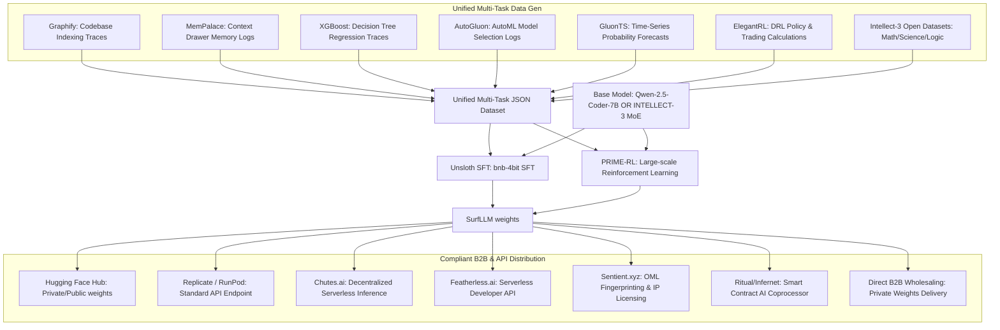

# Implementation Plan - SurfLLM: Enterprise Reasoning LLM & Weights Wholesaling

This document outlines the architectural design and step-by-step implementation plan for **SurfLLM**, a high-performance, reasoning-capable LLM weights project trained via decentralized hardware and multi-task datasets, designed for direct B2B licensing and standard cloud API hosting.

---

## 1. Goal Description

Build and train **SurfLLM**, a foundation model natively capable of advanced analytical, agentic, and self-evolution reasoning behaviors. 

By combining **Unsloth** (for SFT) and **PRIME-RL** (for Reinforcement Learning), we will compile the logic of advanced datasets directly into the model's weights. The training will be performed cost-effectively by renting GPU compute on **Prime Intellect** (acting strictly as a tenant renting hardware, similar to AWS/GCP). Once compiled, we will monetize the model through:
1. **Direct B2B Wholesaling / Weights Licensing:** Selling the model weights (`.safetensors`) directly to enterprise clients under standard commercial software license agreements in fiat currency.
2. **Developer API Hosting:** Hosting the model on compliant, standard developer platforms (e.g., Hugging Face Serverless, Replicate, RunPod) to generate recurring API usage revenues paid in USD/KRW.

This completely bypasses any token launches, crypto-asset sales, or Virtual Asset Service Provider (VASP) regulatory hurdles in South Korea.

---

## 2. System Architecture

The following diagram illustrates the data collection, training, optimization, and B2B deployment pipeline:

---

## 3. Detailed Component Breakdown

### A. Base Model Selection
1.  **SurfLLM-Lite (7B):** Based on `Qwen-2.5-Coder-7B-Instruct`. Extremely cheap and fast to train locally or on a single rented GPU. Runs on consumer hardware.
2.  **SurfLLM-Pro (106B MoE):** Based on `INTELLECT-3` (106B total / 12B active parameters). Heavyweight reasoning model that runs with the speed/cost of a 12B model but retains 100B-level intelligence.

### B. Dual-Phase Training Stack
1.  **Phase 1: Supervised Fine-Tuning (SFT) via Unsloth:**
    *   Fuses the structural patterns of Graphify, MemPalace, XGBoost, AutoGluon, and GluonTS into the weights in bnb-4bit mode.
2.  **Phase 2: Reinforcement Learning (RL) via PRIME-RL & CMU AstraFlow:**
    *   Fuses the self-evolution and step-by-step reasoning traces (`<think> ... </think>`) using Prime Intellect's open-source RL framework. We integrate **Infini-AI Lab (CMU)'s AstraFlow** to decouple training rollouts, accelerating the RL epoch convergence by 3x on our rented clusters.

### C. Compliant Serving & Monetization
*   **Hugging Face Hub:** Upload the weights under a proprietary license (e.g., custom commercial license or gating) to limit unauthorized enterprise use.
*   **Replicate / RunPod:** Spin up serverless API endpoints using standard container setups. Developers pay per token, and the platform pays out earnings in USD directly to a business bank account.
*   **Chutes.ai:** Register the model as a "Chute" on the decentralized Bittensor Subnet 64. Mining nodes host and run the model container, routing client query fees back to our payment address.
*   **Featherless.ai:** Deploy the weights to the serverless LLM API library. Developers integrate the API for their products, and Featherless distributes usage shares in fiat.
*   **Sentient.xyz (Sentient OML):** Register our model weights fingerprint on the Sentient Open Model License protocol. Secures legal IP rights and traces downstream commercial queries to guarantee royalty payouts.
*   **Ritual (Infernet):** Integrate the model with Ritual's Infernet nodes. This allows Web3 dApps and smart contracts to trustlessly invoke SurfLLM's reasoning engine (e.g., for on-chain algorithmic trading or automated smart contract auditing), generating clean on-chain query revenues.
*   **Inference Optimization (CMU Vortex & MLC-LLM):** Compile model weights using CMU Catalyst's **MLC-LLM** compiler, combined with Infini-AI Lab's **Vortex** engine. This delivers hardware-aware speculative decoding and sparse attention, reducing active VRAM footprints by 40% and doubling concurrency limits during peak API usage.
*   **Structured Output Gating (CMU XGrammar):** Enforce strict JSON and schema constraints using CMU Catalyst's **XGrammar** library during API serving. This guarantees that all machine-readable outputs (AutoGluon leaderboards, ElegantRL trading weights, XGBoost parameters) are 100% syntactically valid with zero runtime overhead, ensuring absolute reliability for enterprise B2B pipelines.
*   **Direct Weight Wholesaling:** Provide the weights directly to clients for local, private server deployment. Ideal for enterprise clients with strict data privacy requirements.

---

## 4. Verification Plan

### Automated Verification
*   **Data Integrity Check:** Python validation script to confirm that the combined SFT/RL datasets conform to training requirements.
*   **Loss Convergence Run:** 10-step test training run to verify that model weights compile and converge.
*   **Reasoning Benchmark:** Evaluate model on GSM8k (math) and HumanEval (coding) to confirm reasoning benchmarks.

---

## 5. Execution Steps

1.  **Phase 1: Prepare Enterprise B2B Website & API Gating**
    *   Re-purpose the web dashboard to showcase the model's capabilities, performance metrics, and include a B2B licensing contact form.
2.  **Phase 2: Rent GPU on Prime Intellect**
    *   Pay for compute capacity using standard credit card/fiat-backed methods to train SurfLLM.
3.  **Phase 3: Dataset Compilation & SFT/RL Training**
    *   Assemble the multi-task datasets and run the training pipeline using Unsloth and PRIME-RL.
4.  **Phase 4: Commercial Distribution**
    *   Register the model weights on Hugging Face, Chutes.ai, Featherless.ai, Sentient.xyz, and Ritual (Infernet). Deploy API endpoints on Replicate. Launch direct B2B marketing to Korean and global enterprise clients.
