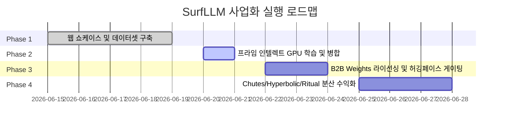

# SurfLLM 사업화 마일스톤 및 투두리스트 (Milestones & Todo List)

본 문서는 SurfLLM의 데이터 구축부터 최종 상용 B2B 계약 및 Web3 DePIN 수익화 가동까지의 전체 '큰 그림(Big Picture)' 로드맵과 세부 실행 항목을 관리하는 마스터 체크리스트입니다.

---

## 📌 [전체 큰 그림 로드맵 (Milestone Roadmap)]

---

## 📋 [단계별 세부 투두리스트 (Todo List)]

### 🟢 Phase 1: 데이터 구축 및 쇼케이스 (완료)
*   [x] **B2B 웹 Showcase 런칭:** 토큰 요소를 제외한 정형화된 모델 사양 쇼케이스 개발 및 Vercel 배포 완료.
*   [x] **독점 학습 데이터셋 생성:** 6대 머신러닝/코드베이스 실행 트레이스가 집약된 5,000 샘플 JSON 데이터셋 컴파일 완료.
*   [x] **Reasoning 구조 검증:** DeepSeek R1 스타일의 `<think>` 태그가 누락 없이 적용되었는지 문법 정밀 검증 완수.

### 🟡 Phase 2: GPU 컴퓨팅 및 모델 훈련 (현재 단계)
*   [ ] **프라임 인텔렉트(Prime Intellect) 빌링 세팅:** GPU 임시 대여를 위한 카드 등록 및 계정 활성화.
*   [ ] **A100 80GB 스팟 노드 대여:** 최저가 마켓 입찰을 통한 학습용 인스턴스 기동.
*   [ ] **Phase 1: Unsloth 지도학습(SFT) 실행:** `train_sft.py` 구동 (소요 시간 1.5시간).
*   [ ] **Phase 2: GRPO 강화학습(RL) 실행:** `train_rl.py` 구동하여 검증기(Verifier) 기반 추론 정렬 수행 (소요 시간 10시간).
*   [ ] **16비트 최종 가중치 병합 및 컴파일:** LoRA 가중치를 완전 병합하여 `.safetensors`로 내보내기.

### 🔵 Phase 3: B2B Weights 라이선싱 및 허깅페이스 게이팅 (훈련 완료 직후)
*   [ ] **Hugging Face Hub 업로드:** 컴파일된 가중치 업로드.
*   [ ] **Access Gating (접근 제한) 설정:** 라이선스 동의 및 기업 정보 입력을 강제하는 Gated Model로 설정하여 무단 도용 방지.
*   [ ] **B2B 독점 계약서 초안 작성:** 기업 온프레미스 배포 및 연간 갱신료 납품을 위한 상용 소프트웨어 라이선싱 표준 계약서 준비.
*   [ ] **독점 Weights 납품 개시:** 기술 보안이 중요한 국내 대기업/금융사 타겟 Weights 홀세일즈 세일즈 개시.
*   [ ] **SuperX (superx.so) 마케팅 세팅:** X(트위터) 기반 테크 트렌드 분석 및 글로벌 AI/DePIN 타겟 오가닉 그로스 마케팅 기동.

### 🟣 Phase 4: 글로벌 분산형 Web3 Monetization 가동 (유통 다각화)
*   [ ] **Chutes.ai (Bittensor) 배포:** Bittensor Subnet 64에 등록하여 분산 채굴 노드 구동 및 TAO 리워드 정산 시작.
*   [ ] **Featherless.ai 및 Hyperbolic.ai API 탑재:** 모델 유통망에 등록하여 전 세계 개발자 대상 실시간 API 트래픽 과금(USD/KRW) 개시.
*   [ ] **Ritual (Infernet) 스마트 컨트랙트 연동:** 온체인 AI 코프로세서 노드로 연동하여 스마트 컨트랙트 호출 당 피아트/유틸리티 수수료 자동 수확.
*   [ ] **SuperX 기반 오가닉 스케일업:** AI/수학적 추론 벤치마크 및 CMU Catalyst/ZeroMQ 혁신 바이럴 스레드 발행을 통한 `surfrobot.vercel.app` B2B 리드 유입 극대화.
