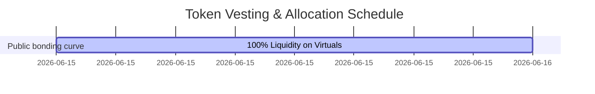

# SurfRobot (`$SRBT`) - Virtuals.io Submission Kit

This document contains all the materials, descriptions, copy templates, and technical briefs you need to submit and launch **SurfRobot (`$SRBT`)** on [Virtuals Protocol](https://www.virtuals.io/).

---

## 1. Agent Profile & Basic Info

| Field | Submission Value | Notes |
| :--- | :--- | :--- |
| **Agent Name** | SurfRobot | Brand name of the protocol |
| **Token Ticker** | SRBT | Token symbol for the bonding curve |
| **Core Category** | AI Infrastructure / DePIN / Robotics | Select AI Agent / Utility |
| **Short Tagline** | Decentralized DePIN AI factory generating secure physical training video datasets for robotics. | Max 150 characters |
| **Primary Logo** | Use the generated pixel logo: `public/logo.png` | Retro pixel-art surfing robot |
| **Text Logo** | Use the generated text logo: `public/text_logo.png` | Retro 8-bit typographic logo |
| **Combined Banner**| Use the combined logo: `public/combined_logo.png` | Banner containing both robot and text |
| **Associated Website**| [Your Deployed Vercel URL / Domain] | Add the Vercel link once deployed |

---

## 2. Platform Pitch & Descriptions

Use these pre-written, highly polished texts for your Virtuals.io platform submission.

### Short Pitch (App Store / Card Description)
SurfRobot (`$SRBT`) is an autonomous DePIN-driven synthetic data factory for physical AI. By utilizing serverless GPU nodes and Geo-Consistent Video Diffusion (GCVD), SurfRobot generates high-fidelity robotic training datasets. All datasets are protected under Sentient Opt-in Model Licensing (OML) to secure corporate IP, creating a direct value loop where corporate purchase fees trigger automatic `$SRBT` token buyback and burn protocols.

### Detailed Description (About Page / Long Pitch)
```markdown
### Introduction
The biggest bottleneck in scaling physical AI and humanoid robotics is the "Data Gap." Current robots require millions of hours of physical trial-and-error to learn simple tasks like grasping, pouring, or cleaning. 

SurfRobot (`$SRBT`) solves this by acting as a decentralized, autonomous robotic data factory. Operating entirely on serverless GPU networks, SurfRobot generates millions of photorealistic, physics-aligned synthetic training frames using Geo-Consistent Video Diffusion (GCVD).

### Key Technological Pillars
1. **DePIN Execution Layer**: SurfRobot leases distributed, serverless GPU clusters to render 3D simulation frames and run diffusion scaling loops cost-effectively.
2. **Geo-Consistent Video Diffusion (GCVD)**: Transforms raw 3D simulation wireframes into photorealistic physical world data, ensuring perfect alignment with real-world gravity, light, and friction.
3. **Sentient OML Licensing**: Protects proprietary training weights. Corporate clients buy verified datasets with strict cryptographic ownership, preventing data leakage.
4. **Automated Ledger**: Every dataset generation, GPU lease, and sale is recorded on a transparent, public-facing ledger.

### Token Economics & Utility (`$SRBT`)
`$SRBT` is the native utility token powering the SurfRobot ecosystem:
* **Ecosystem Burn**: 1% of all corporate dataset sales (paid via B2B API keys) is automatically market-bought and permanently burned.
* **GPU Node Staking**: Distributed compute providers stake `$SRBT` to participate in rendering jobs and earn execution fees.
* **Governance**: Token holders direct treasury allocations (45% reserved for GPU pool leasing, 35% for core software development, 20% for developer marketing).
```

---

## 3. Tokenomics Structure

When creating the agent token on Virtuals.io, configure the token distribution as follows:



### Allocation Breakdown
* **Public Bonding Curve**: 100% of the token supply starts on the permissionless Virtuals.io bonding curve.
* **Creator Allocation**: Lock **10%** of the total supply for development and operations:
  * **2% (Genesis Operations Reserve)**: Unlocked at TGE (Token Generation Event) to fund initial serverless GPU leases and API keys.
  * **8% (Development Vesting)**: Locked and vested linearly over 12 months to align incentives.
* **Transaction Fee**: Route the **1% trading fee** directly to your creator wallet. This provides immediate, liquid cashflow from daily trading volume without requiring token sales.

---

## 4. Social Launch Marketing Templates

Use these templates to kick off your marketing campaigns on **Twitter/X** and **Farcaster (Warpcast)**.

### Tweet 1: The Announcement (High Hype)
The physical AI revolution has a data bottleneck. 🤖🌊

Introducing **SurfRobot (`$SRBT`)**—the first decentralized DePIN synthetic data factory launching on @virtuals_io. 

We turn serverless GPU power into high-fidelity robotic training videos. 
Secure. Photorealistic. Scaleable.

Join the wave: [Link to Virtuals]
#AI #DePIN #Robotics `$SRBT`

### Tweet 2: Technical Value Prop (For Alpha Hunters)
Why SurfRobot (`$SRBT`) matters:
1️⃣ **Sentient OML**: Cryptographically secure training datasets for top-tier robotics labs.
2️⃣ **GCVD Technology**: Turning 3D sim wireframes into real-world photorealistic training frames.
3️⃣ **Ecosystem Burn**: 1% of B2B dataset sales buy back and burn `$SRBT`.

💻 View our real-time telemetry: [Link to Website]

### Farcaster Cast (Warpcast Developer Community)
Hey Farcaster /base network! 🏄‍♂️🤖
We are launching SurfRobot (`$SRBT`) on Virtuals. 

We're bridging the gap between simulation and reality by scaling robotic training datasets using serverless GPU clusters. Secure, decentralized, and backed by a robust token burn loop. 

Check out the live interface and interactive simulation sandbox: [Link to Website]
