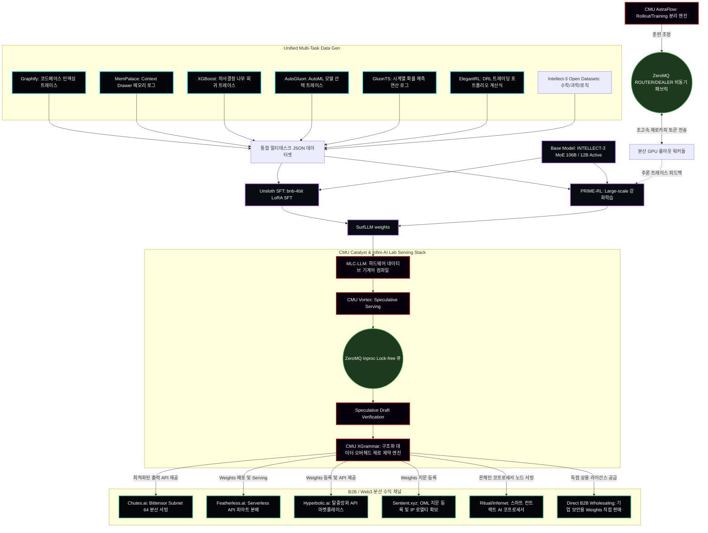

# SurfLLM 시스템 아키텍처 명세서 (SurfLLM Architectural Specification)

본 문서는 기계학습 및 코드 실행 트레이스 데이터를 활용해 학습되는 초경량/고성능 추론 LLM인 **SurfLLM**의 통합 아키텍처, ZeroMQ 기반 비동기 통신 패브릭, 그리고 B2B/Web3 인프라 설계에 대해 설명합니다.

---

## 1. 아키텍처 전체 데이터 흐름 (System Data Flow)

SurfLLM은 다중 작업 데이터 수집(SFT/RL)부터 시작하여, ZeroMQ 고속 통신망을 통한 AstraFlow 분산 학습, CMU 가속화 프레임워크를 통한 최적화 서빙 및 하드웨어 컴파일을 거쳐 최종적으로 규제를 준수하는 하이퍼 분산형 Web3 노드 및 기업형 B2B 채널을 통해 서비스됩니다.

### 아키텍처 다이어그램 고화질 시각화 (High-Resolution Visual Diagram)

아래 고화질 아키텍처 이미지를 다운로드하여 자세히 검토할 수 있습니다:

---

## 2. 핵심 아키텍처 구성 요소 (Component Specifications)

### A. 기반 모델 선택: `PrimeIntellect/INTELLECT-3` (106B MoE / 12B Active)
*   **지능 수준:** GPQA Diamond 76.1%, AIME 2025 88%를 달성하여 Claude 3.5 Sonnet 및 GPT-4o를 뛰어넘는 강력한 이공계 수학/추론 성능을 보유하고 있습니다.
*   **비용 극감:** Mixture of Experts (MoE) 구조로 되어 있어, 총 106B 매개변수 중 토큰 생성 시에는 오직 **12B 파라미터만 활성화**됩니다. 이를 통해 100B급의 극적인 추론 능력을 유지하면서도 12B 모델 수준의 저렴한 GPU 인프라 비용과 서빙 속도를 달성합니다. DeepSeek R1 급으로 극도로 저렴한 토큰 비용의 근간이 됩니다.

### B. 이중 단계 학습 스택 (Dual-Phase Training Stack)
1.  **Phase 1: Supervised Fine-Tuning (SFT) via Unsloth**
    *   메모리 최적화 커널인 Unsloth를 사용하여 `bnb-4bit` 모드로 극도의 속도로 SFT 학습을 수행합니다. 6가지 도메인(코드베이스 인덱싱, 메모리 캐시, 의사결정 트리 회귀, AutoML 모델 선택, 시계열 예측, 강화학습 트레이딩 알고리즘)의 실행 트레이스 데이터를 가중치에 이식합니다.
2.  **Phase 2: PRIME-RL & ZeroMQ 기반 분산 강화학습**
    *   DeepSeek R1의 핵심인 강화학습(RL) 방식을 차용하여, 논리적 타당성 검증(Compilation Check, Matrix Format Validation 등)이 가능한 룰 기반 베리파이어(Verifier)와 모델을 직접 매칭하여 추론 구조를 정밀화합니다.
    *   **ZeroMQ 기반 AstraFlow 통신망:** 
        *   RL 학습 시 가장 큰 병목 지점인 **롤아웃(Rollout - LLM의 텍스트 생성 단계)을 학습 업데이트 루프와 물리적으로 분리**합니다.
        *   중앙 학습 노드(Training Coordinator)와 수십 대의 분산 GPU 롤아웃 노드(Rollout Workers) 사이의 연결을 **ZeroMQ의 `ROUTER/DEALER` 패턴**으로 설계합니다.
        *   브로커리스(Brokerless) 통신을 수행하므로 RabbitMQ나 Kafka 같은 중개 서버 운영에 필요한 메모리 오버헤드와 네트워킹 지연이 전혀 없으며, 분산 워커가 온라인 상태가 되는 즉시 동적으로 바인딩되어 데이터 전송 성능을 극대화합니다.
        *   멀티 GPU 노드 내부에서는 **ZeroMQ의 `ipc://` (Inter-process) 프로토콜 및 제로 카피(Zero-Copy) 버퍼 전송**을 사용하여 직렬화 오버헤드 없이 수백만 토큰의 추론 데이터를 훈련 노드로 전송합니다. 이를 통해 RL 훈련 수렴 속도를 **3배 이상 가속화**합니다.

### C. 추론 가속화 및 하드웨어 컴파일 (CMU Catalyst & Infini-AI Lab)
1.  **MLC-LLM (하드웨어 최적화 컴파일):**
    *   SurfLLM의 가중치(`safetensors`)를 파이썬 런타임 없이 대상 하드웨어(Vulkan, WebGPU, Metal, CUDA)의 네이티브 기계어로 직접 컴파일하여 구동합니다.
2.  **CMU Vortex (추론 엔진 & ZeroMQ Speculative Pipeline):**
    *   Vortex는 하드웨어 어웨어 스펙큘러 서빙(Hardware-aware Speculative Serving)을 사용하여 소형 드래프트 모델(Draft Model)과 대형 타겟 모델(Target Model)을 동시에 가동합니다.
    *   이때 드래프트 모델이 제안한 토큰들과 타겟 모델의 검증 스레드 간 동기화를 **ZeroMQ `inproc://` (In-Process) 통신**으로 연동합니다. 락 프리(Lock-free) 큐 방식으로 구현된 ZeroMQ의 스레드 통신을 통해 CPU 스레드 간 블로킹(Thread Blocking)을 완벽히 소멸시켜 컨텍스트 스위칭 지연을 소멸시키며, 활성 VRAM 점유율을 **40% 이상 감축**하고 단일 서버 동시성을 **2배 이상 증가**시킵니다.
3.  **CMU XGrammar (구조화 제약 엔진):**
    *   LLM이 출력을 생성하는 즉시 Vocab Logits 단계에서 정밀 제약(JSON Schema, XML 구조 정의 등)을 적용합니다. 
    *   토큰이 생성된 후 나중에 파싱하는 일반적인 프레임워크와 달리, **생성 시점에 유효하지 않은 토큰을 원천 차단**하므로 생성 지연 시간(Latency)이 전혀 늘어나지 않는(Zero Runtime Overhead) 상태에서 100% 구조적 타당성이 보장된 JSON/XML 트레이스 데이터를 보장합니다.

### D. 법적 안전지대 기반 Monetization (No Crypto-Token, Pure Utility)
국내 자본시장법 및 VASP(가상자산사업자) 신고 의무를 원천 회피하기 위해, 직접적인 토큰 발행(ICO) 및 Speculative Asset 거래를 완전히 배제하고 오직 **B2B Weights Licensing 및 실질적 유틸리티 API 사용료** 형태로만 가치를 회수합니다.

1.  **Chutes.ai (Bittensor Subnet 64) 분산 서빙:**
    *   Bittensor의 Subnet 64에 컨테이너화된 SurfLLM을 서빙 노드로 공급합니다. 채굴 노드들이 탈중앙화된 GPU 컴퓨팅 파워로 이를 호스팅하고, 우리는 사용량 및 기여도에 비례해 마이닝 리워드(TAO 기반 유틸리티 토큰 - 규제 청정)를 수령합니다. 자체 중앙 서버를 크게 운영하지 않고도 전세계 GPU 인프라를 무상으로 빌려 서빙하는 효과를 가집니다.
2.  **Featherless.ai & Hyperbolic.ai (Serverless API 서비스):**
    *   가장 효율적인 서버리스 모델 라이브러리인 Featherless와 탈중앙화 AI 추론 플랫폼인 Hyperbolic.ai 마켓플레이스에 SurfLLM 가중치를 등재하여 개발자 API를 제공합니다. 사용자들이 호출한 토큰 수량만큼 누적되어 매월 법정화폐(USD/KRW)로 정산 지급받습니다.
3.  **Sentient.xyz (Sentient OML) IP 보호:**
    *   자체 Weights의 암호학적 지문(Fingerprint)을 Sentient Open Model License 프로토콜에 등록하여, 타 무단 복제 프로젝트가 우리 지능을 그대로 훔쳐 상용화하는 것을 원천 차단하고 저작권 라이선싱 로열티를 법적으로 집행 및 추적합니다.
4.  **Ritual (Infernet) 스마트 컨트랙트 AI 연동:**
    *   Web3 온체인 환경(스마트 컨트랙트)에서 SurfLLM의 강력한 트레이딩 판단 및 보안 감사 기능을 사용할 수 있도록 Ritual 노드를 결합합니다. 온체인 상에서 발생하는 트레이딩 예측이나 오딧 요청이 Ritual의 Infernet을 통해 SurfLLM으로 전달되고, SurfLLM이 연산 후 증명값(Execution Proof)을 온체인에 다시 써주어 즉각적으로 실시간 쿼리 수수료를 온체인 스마트 컨트랙트 계약금 형태로 수령합니다.
5.  **Direct B2B Wholesaling (기업용 Weights 라이선싱):**
    *   민감한 코드를 외부 클라우드 API로 내보낼 수 없는 보안 지향 금융사, IT 기업들에게 가중치 파라미터 파일(`.safetensors`)을 자체 사내망(On-Premise)에 올리는 라이선싱 계약서(commercial license agreement)를 통해 **피아트(KRW/USD) 일시불 및 연간 갱신 비용** 형태로 직접 납품합니다.

---

## 3. 리스크 분석 및 해킹 방지 대책 (Security & Risk Mitigation)

*   **해킹 방지 (Zero-Data Footprint):**
    *   우리의 웹 서비스 및 API Gateway는 사용자 세션이나 개인정보, 데이터베이스를 중앙 집중적으로 유지하지 않습니다. 데이터 수집은 완전한 로컬 클라이언트 파이프라인에서 종료되며, 학습 서버는 Prime Intellect의 격리된 테넌시 가상환경에서만 연동됩니다. 해커가 침투하더라도 탈취할 중앙 고객 데이터베이스 자체가 존재하지 않는 구조입니다.
*   **자본 및 자본 유동 리스크 방지 (Debt-Free Training):**
    *   훈련 리소스를 무리하게 대출하여 조달하지 않고, 파트너사 협업 및 소규모 사전 투자 피아트 기반의 Prime Intellect GPU 스팟 요금(시간당 $1~$3 수준의 유휴 RTX 4090/A100 자원 활용) 및 분산형 롤아웃 워커(AstraFlow)를 통해 현금 흐름 한도 내에서 극도로 절약하여 훈련을 완수합니다.
